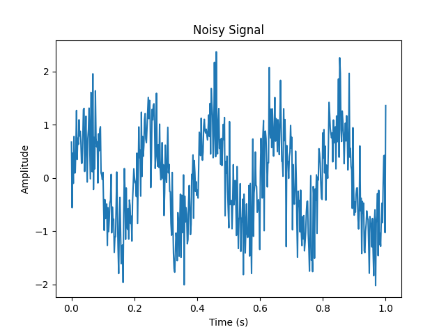
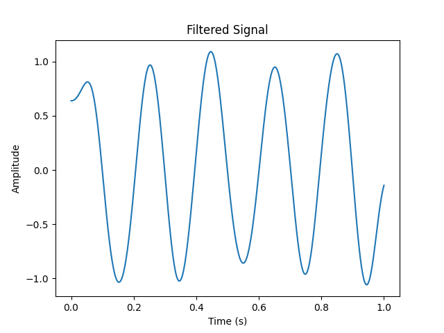
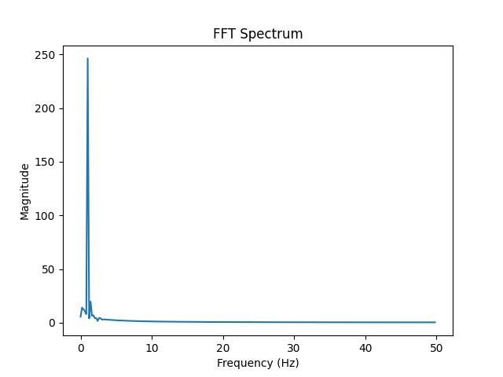

# Signal Analysis Using Fourier and Laplace Transforms  

## 📌 Overview  

This project demonstrates **signal processing techniques** using **Fourier and Laplace transforms** in Python.  
The focus is on **noise reduction, filtering, and frequency-domain analysis**, with applications in **biomedical signal processing** (e.g., ECG/EEG denoising).  

## 📅 Project Timeline

- **Duration:** Feb 2011 – Mar 2011  

- **Academic Year** Second Year - Electrical and Electronics Engineering
  
- **Location:** VIT University, Vellore,India  

## ⚠️ Disclaimer

This project was originally developed and tested in **2011**.  
At that time, it ran successfully in the available Python libraries and environments. 

**⚡ Modernization (v0.1.0 Release)**

This repository has been lightly modernized to run on current Python environments (Python 3.11) while preserving the original algorithmic logic from 2011. Key updates include:

Environment pins: Updated core dependencies for modern Python versions:

numpy==2.0.*, scipy==1.13.*, matplotlib==3.9.*, sympy==1.13.*

Dual environment strategy: Legacy 2011 environment pinned in environment-2011.txt for transparency.

Demo CLI: Run the pipeline with:

python -m src.signal_analysis --demo


Generates synthetic noisy signals, filtered outputs, FFT spectrum, and metrics CSV (SNR/PSNR).

CI/CD integration:

pytest smoke tests ensure plots and CSV metrics are generated.

GitHub Actions workflow validates the pipeline automatically on every push/pull request.

Metrics and plots are uploaded as workflow artifacts for review.

Project structure refactored:

Reusable code centralized in src/signal_analysis.py

Demo and tests separated for maintainability

results/plots/ folder stores before/after plots and frequency spectrum

Release notes v0.1.0:

First modernization release demonstrating that the pipeline runs in a lean, modern environment while producing reproducible artefacts.

Due to advancements and changes in library versions (e.g., `numpy`, `scipy`, `matplotlib`, etc.),  
some parts of the code may not run exactly as intended in modern environments without modifications.  

I have kept this repository public to **showcase my problem-solving, algorithmic approach, and project experience** to potential recruiters, particularly in the UK.  
Please note that the focus here is on the **concepts and implementation methods**, rather than up-to-date compatibility.

**Modules Used:** 


| **Module**                                               | **Application in Project**                                                                                                |
| -------------------------------------------------------- | ------------------------------------------------------------------------------------------------------------------------- |
| **DC Machines and Transformers**                         | Understanding signal distortions due to electrical machines and noise sources in real-world biomedical systems.           |
| **Electromagnetic Field Theory**                         | Basis of wave propagation and interaction of signals with fields, essential for understanding ECG/EEG signal acquisition. |
| **Complex Variables and Partial Differential Equations** | Mathematical foundation for Fourier and Laplace transforms, system modeling, and filter design.                           |
| **Environmental Studies**                                | Consideration of sustainable biomedical applications and ethical handling of patient data.                                |
| **Data Structures and Algorithms**                       | Efficient implementation of FFT, filtering algorithms, and data handling in Python.                                       |

---
## 📂 Data & Attribution

This project uses **ECG/EEG signals** from **PhysioNet** for demonstration purposes. All example files included in this repository are **synthetic signals or tiny excerpts** of the original dataset.

- Original datasets:
  - Moody GB & Mark RG. The impact of the MIT-BIH Arrhythmia Database. *IEEE Computers in Cardiology*, 2001.
  - Goldberger AL et al. PhysioBank, PhysioToolkit, and PhysioNet: Components of a new research resource for complex physiologic signals. *Circulation*, 2000.

- PhysioNet License: [Open Database License (ODC-By 1.0)](https://physionet.org/about/terms-of-use/)

- Full dataset page: [MIT-BIH Arrhythmia Database](https://physionet.org/content/mitdb/1.0.0/)


## ⚙️ Features  
- Generate and visualize **synthetic noisy signals**  
- Apply **Fast Fourier Transform (FFT)** for frequency analysis  
- Design and implement **Butterworth low-pass filters** for noise removal  
- Compute **Laplace transforms** using symbolic math  
- Visualize **time-domain and frequency-domain signals** before and after filtering  

---

## 📂 Project Structure
Signal-Analysis-Using-Fourier-and-Laplace-Transforms/
├── data/ # Input data files
├── demo/ # Demo scripts and sample data
├── docs/ # Documentation files
├── results/ # Output results (plots, metrics)
├── src/ # Source code for signal analysis
├── templates/ # Template files for reports or outputs
├── tests/ # Unit and integration tests
└── .env.template # Environment variable template


---
## 🛠 Environment Strategy (Dual-Env)

**Modern (2025)** – fully supported:


# Install modern environment
python3.11 -m venv venv
source venv/bin/activate
pip install -e .[pipeline]

---

## 🚀 Getting Started  

### 🔧 Requirements  
- Python 3.8+  
- NumPy  
- Matplotlib  
- SciPy  
- SymPy  

Install dependencies:  
pip install numpy matplotlib scipy sympy

---
---

## 🌐 Run the UI (Flask Frontend)

This project also includes a minimal **Flask app (app.py)** to visualize results interactively.

### ▶️ Run the Flask App
```bash
python app.py
```

🩺 Health Check

Verify the app is running with:

curl http://127.0.0.1:5000/health


Expected response:

"status": "ok"


## ⚡ Quick Start

1. Clone the repository:

   ```bash
   git clone https://github.com/Dineshkumarsammeta/Signal-Analysis-Using-Fourier-and-Laplace-Transforms.git
   cd Signal-Analysis-Using-Fourier-and-Laplace-Transforms
   ```
2.nstall dependencies:

```bash
pip install -r requirements.txt
```
3.Run the analysis script:

```bash
python src/signal_analysis.py
```

📊 Results
Noisy Signal (Time Domain)

Frequency Spectrum (FFT)

Filtered Signal (After Low-Pass Filter)

Skills Demonstrated

Digital Signal Processing (DSP)

Fourier Analysis & Filtering

Laplace Transforms (System Modeling)

Python (NumPy, SciPy, SymPy, Matplotlib)

---
## 📊 Signal Denoising — Before vs After

**Noisy Signal (input data)**  


**Filtered Signal (after low-pass filter)**  


**Frequency Spectrum (FFT analysis)**  


## 📊 Repository Health

This project is under continuous improvement. An [Audit report](docs/repo_audit.md) has been created to track repository health and enhancements.

### Key Focus Areas
- **Releases & Versioning:** To be added — future releases will follow semantic versioning for clarity and reproducibility.  
- **Expanded Test Coverage:** Planned integration with `pytest` to validate FFT, filtering, and Laplace transform outputs.  
- **Metrics / Artifacts Integration:** Export of CSV and PNG results in CI workflows to ensure reproducibility and easy visualization of outputs.


### 🔧 contact 
For questions, collaboration, or feedback, please contact:  
**Sammeta Dinesh Kumar** — [sammetadineshkumar@gmail.com]
- 🌐 [Portfolio](https://dineshkumarsammeta.github.io/)  
- 🔗 [LinkedIn](https://www.linkedin.com/in/dineshsammeta)   
